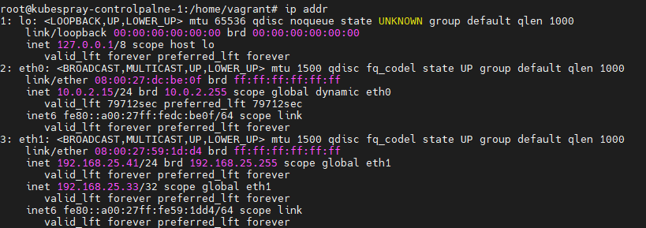

# 개요
kubeprary설치 - External LB설정

<br>

# 공통설정
```sh
sudo swapoff -a
sudo sed -i '/swap/d' /etc/fstab
sudo systemctl stop ufw
sudo systemctl disable ufw
```

<br>

# bootstrap 서버 설정
## 파이썬3 설치
```sh
sudo apt install python3-pip python3-setuptools virtualenv -y
```

## 파이썬 가상환경 활성화
```sh
virtualenv --python=python3 venv
. venv/bin/activate
```

## clone kubespray 
```sh
git clone https://github.com/kubernetes-sigs/kubespray
```

## 파이썬 패키지 설치
```
cd kubespray
pip install -r requirements.txt
```

## ansible 인벤토리 설정
```conf
cp -rfp inventory/sample inventory/mycluster
vi inventory/mycluster/inventory.ini

[all]
node1 ansible_host=192.168.25.41 ip=192.168.25.41 etcd_member_name=etcd1
node2 ansible_host=192.168.25.42 ip=192.168.25.42 etcd_member_name=etcd2
node3 ansible_host=192.168.25.43 ip=192.168.25.43 etcd_member_name=etcd3
node4 ansible_host=192.168.25.44 ip=192.168.25.44
node5 ansible_host=192.168.25.45 ip=192.168.25.45

# ## configure a bastion host if your nodes are not directly reachable
# [bastion]
# bastion ansible_host=x.x.x.x ansible_user=some_user

[kube_control_plane]
node1
node2
node3

[etcd]
node1
node2
node3

[kube_node]
node4
node5

[calico_rr]

[k8s_cluster:children]
kube_control_plane
kube_node
calico_rr
```

## CRI를 containerd로 변경(기존 docker)
```sh
vi inventory/mycluster/group_vars/k8s_cluster/k8s-cluster.yml
container_manager: containerd
```

```sh
vi inventory/mycluster/group_vars/etcd.yml
etcd_deployment_type: host
```

<br>

# HA설정(keepalive, haproxy)

## 설치
* 각 controlplane 노드에서 실행
```sh
sudo apt install haproxy keepalived -y
```

## keepalived 설정
### controlplane1 설정
> 파일 설정후 sudo systemctl start keepalived, sudo systemctl enable keepalived 실행
 
```conf
sudo vim /etc/keepalived/keepalived.conf

vrrp_script chk_haproxy {
  script "killall -0 haproxy"
  interval 2
  weight 2
}

vrrp_instance VI_1 {
  interface eth1
  state MASTER
  advert_int 1
  virtual_router_id 51
  priority 102
  unicast_src_ip 192.168.25.41
  unicast_peer {
      192.168.25.42
      192.168.25.43
   }
  virtual_ipaddress {
    192.168.25.33
  }
  track_script {
    chk_haproxy
  }
}
```

### controlplane2 설정
> 파일 설정후 sudo systemctl start keepalived, sudo systemctl enable keepalived 실행

```conf
sudo vim /etc/keepalived/keepalived.conf

vrrp_script chk_haproxy {
  script "killall -0 haproxy"
  interval 2
  weight 2
}

vrrp_instance VI_1 {
  interface eth1
  state MASTER
  advert_int 1
  virtual_router_id 51
  priority 101
  unicast_src_ip 192.168.25.42
  unicast_peer {
      192.168.25.41
      192.168.25.43
   }
  virtual_ipaddress {
    192.168.25.33
  }
  track_script {
    chk_haproxy
  }
}
```

### controlplane3 설정
> 파일 설정후 sudo systemctl start keepalived, sudo systemctl enable keepalived 실행

```conf
sudo vim /etc/keepalived/keepalived.conf

vrrp_script chk_haproxy {
  script "killall -0 haproxy"
  interval 2
  weight 2
}

vrrp_instance VI_1 {
  interface eth1
  state MASTER
  advert_int 1
  virtual_router_id 51
  priority 100
  unicast_src_ip 192.168.25.43
  unicast_peer {
      192.168.25.41
      192.168.25.42
   }
  virtual_ipaddress {
    192.168.25.33
  }
  track_script {
    chk_haproxy
  }
}
```

* 성공하면 keeplaived VIP가 생성


<br>

# 참고자료
* https://computingforgeeks.com/deploy-kubernetes-cluster-centos-kubespray/