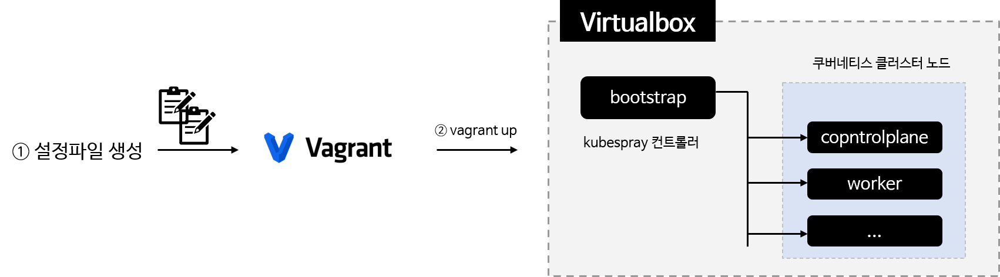
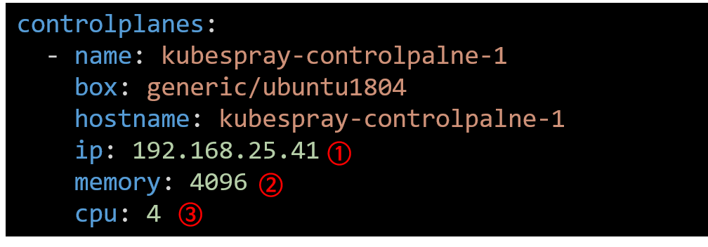
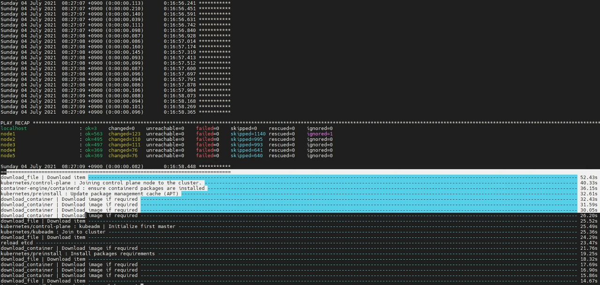

- [개요](#개요)
- [인프라 구성](#인프라-구성)
  - [개요](#개요-1)
  - [설정](#설정)
  - [실행](#실행)
  - [원격접속](#원격접속)
- [공통설정](#공통설정)
- [bootstrap 서버 설정](#bootstrap-서버-설정)
  - [파이썬3 설치](#파이썬3-설치)
  - [파이썬 가상환경 활성화](#파이썬-가상환경-활성화)
  - [clone kubespray](#clone-kubespray)
  - [파이썬 패키지 설치](#파이썬-패키지-설치)
  - [ansible 인벤토리 설정](#ansible-인벤토리-설정)
  - [CRI를 containerd로 변경(기존 docker)](#cri를-containerd로-변경기존-docker)
- [설치](#설치)
- [kubectl 이용방법](#kubectl-이용방법)

# 개요
kubeprary설치 - External LB설정

> 블로그 글: https://malwareanalysis.tistory.com/132
> 유투브 영상: https://youtu.be/12vNy4IvF14
> 발표 pdf: https://www.slideshare.net/sungwookchoi5/onpremise-kubespray

<br>

# 인프라 구성
## 개요
* vagrant로 인프라 구성 자동화


## 설정
* config.yml파일에 각 VM 하드웨어와 IP설정(bridge)
  * 사용하지 않는 IP설정


## 실행
```sh
vagrant up
```

## 원격접속
* putty 등 ssh원격접속 도구로 접속
* 계정: vagrant, 비밀번호: vagrant

<br>

# 공통설정
* bootstrap서버를 제외한 모든 서버에 설정
```sh
sudo swapoff -a
sudo sed -i '/swap/d' /etc/fstab
sudo systemctl stop ufw
sudo systemctl disable ufw
```

<br>

# bootstrap 서버 설정
## 파이썬3 설치
```sh
sudo apt install python3-pip python3-setuptools virtualenv -y
```

## 파이썬 가상환경 활성화
```sh
virtualenv --python=python3 venv
. venv/bin/activate
```

## clone kubespray 
```sh
git clone https://github.com/kubernetes-sigs/kubespray
```

## 파이썬 패키지 설치
```
cd kubespray
pip install -r requirements.txt
```

## ansible 인벤토리 설정
* node1,2,3은 controlplane노드
* node4,5는 worker노드
```conf
cp -rfp inventory/sample inventory/mycluster
vi inventory/mycluster/inventory.ini

[all]
node1 ansible_host=192.168.25.41 ip=192.168.25.41 etcd_member_name=etcd1
node2 ansible_host=192.168.25.42 ip=192.168.25.42 etcd_member_name=etcd2
node3 ansible_host=192.168.25.43 ip=192.168.25.43 etcd_member_name=etcd3
node4 ansible_host=192.168.25.44 ip=192.168.25.44
node5 ansible_host=192.168.25.45 ip=192.168.25.45

# ## configure a bastion host if your nodes are not directly reachable
# [bastion]
# bastion ansible_host=x.x.x.x ansible_user=some_user

[kube_control_plane]
node1
node2
node3

[etcd]
node1
node2
node3

[kube_node]
node4
node5

[calico_rr]

[k8s_cluster:children]
kube_control_plane
kube_node
calico_rr
```

## CRI를 containerd로 변경(기존 docker)
```sh
vi inventory/mycluster/group_vars/k8s_cluster/k8s-cluster.yml
container_manager: containerd
```

```sh
vi inventory/mycluster/group_vars/etcd.yml
etcd_deployment_type: host
```

<br>

# 설치
```sh
ansible-playbook -i inventory/mycluster/inventory.ini  --become --become-user=root cluster.yml
```


<br>

# kubectl 이용방법
* controlplane에 접속 후 root계정으로 스위칭
```sh
sudo su
kubectl
```